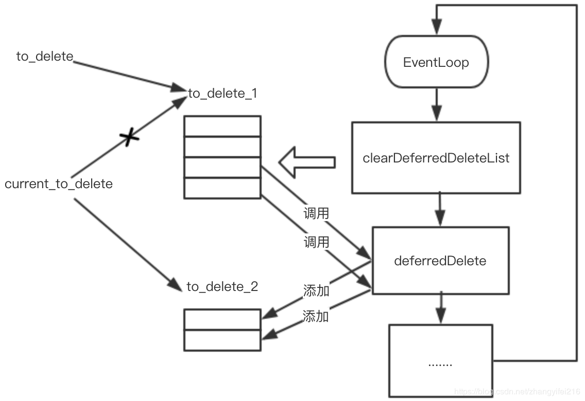

##### 4.2.3 DeferredDeletable

​	本小节是`Dispatcher`中最重要的一个部分`DeferredDeletable`，又被称为延迟析构，目的是用于安全的进行对象析构。C++语言本身会存在对象析构了，但还有引用它的指针存在，这个时候通过这个指针访问这个对象就会导致未定义行为了。因此写C++的同学就需要特别注意一个对象的生命周期问题，要保证引用一个对象的时候，对象还没有被析构。在C++中有不少方案可以来解决这个问题，典型的像使用shared_ptr的方式。而本文的要分析的`DeferredDeletable`则是使用另外一种方式来解决对象安全析构问题，这个方案的并不是一个通用的方案，仅能解决部分场景下的对象安全析构问题，但是对于Envoy使用到的场景已经足够了，接下来我们将分析它是如何做到对象安全析构的。

​	`DeferredDeletable`本身是一个空接口，所有要进行延迟析构的对象都要继承自这个空接口。在Envoy的代码中像下面这样继承自`DeferredDeletable`的类随处可见。

```cpp
class DeferredDeletable {
public:
  virtual ~DeferredDeletable() {}
};

class Connection : public Event::DeferredDeletable { .... }

/**
 * An instance of a generic connection pool.
 */
class Instance : public Event::DeferredDeletable { ..... }

/**
 * Implementation of AsyncRequest. This implementation is capable of 
 * sending HTTP requests to a ConnectionPool asynchronously.
 */
class AsyncStreamImpl : public Event::DeferredDeletable{....}
```

​		这些继承`DeferredDeletable`接口的类都有一个特点，这些类基本上都是一些具有短暂生命周期的对象，比如连接对象、请求对象等。这也正是上文中提到的延迟析构并非是是一个通用方案，只是针对Envoy中的一些特定场景。`DeferredDeletable`和`Dispatcher`是密切相关，是基于`Dispatcher`来完成的。`Dispatcher`对象有一个`vector`保存了所有要延迟析构的对象。

```cpp
class DispatcherImpl : public Dispatcher {
  ......
 private:
  ........
  std::vector<DeferredDeletablePtr> to_delete_1_;
  std::vector<DeferredDeletablePtr> to_delete_2_;
  std::vector<DeferredDeletablePtr>* current_to_delete_;
 }
```

​	`to_delete_1_`和`to_delete_2_`就是用来存放所有的要延迟析构的对象，这里使用两个`vector`存放，为什么要这样做呢？或许可能有人会想这是因为要保证线程安全，不能往一个正在析构的列表中添加对象。其实并非如此，多线程操作一个队列本就是非线程安全的，所以这里使用两个队列的目的并非是为了线程安全的。带着这个疑问继续往下分析，`current_to_delete_`始终指向当前正要析构的对象列表，每次执行完析构后就交替指向另外一个对象列表，来回交替。

```cpp
void DispatcherImpl::clearDeferredDeleteList() {
  ASSERT(isThreadSafe());
  std::vector<DeferredDeletablePtr>* to_delete = current_to_delete_;
  size_t num_to_delete = to_delete->size();
  // 如果正在删除或者没有对象可删除就返回
  if (deferred_deleting_ || !num_to_delete) {
    return;
  }
  // 正式开始删除对象
  ENVOY_LOG(trace, "clearing deferred deletion list (size={})", num_to_delete);
  // current_to_delete_指向另外一个没有进行删除的队列
  if (current_to_delete_ == &to_delete_1_) {
    current_to_delete_ = &to_delete_2_;
  } else {
    current_to_delete_ = &to_delete_1_;
  }
  // 设置正在删除的标志
  deferred_deleting_ = true;
  // 开始进行对象析构
  for (size_t i = 0; i < num_to_delete; i++) {
    (*to_delete)[i].reset();
  }
	
  to_delete->clear();
  // 结束
  deferred_deleting_ = false;
}
```

​	上面的代码中我们可以看到在执行对象析构的时候先使用`to_delete`来指向当前正要析构的对象列表，然后将`current_to_delete_`指向另外一个列表，这里为什么要设置`deferred_deleting_`标志呢? 这是因为`clearDeferredDeleteList`可能会被调用多次，如果已经有对象正在析构，那么就不能再进行析构操作了，因此这里通过`deferred_deleting_`标志来保证同一时刻只能有一个对象析构的任务在执行。


> 假设没有`deferred_deleting_`标志，如果此时正在执行`to_delete_1_`队列的对象析构，在析构的过程中调用了`clearDeferredDeleteList`，那么这个时候会对`to_delete_2_`队列开始析构，并且将`current_to_delete_`指向`to_delete_1_`，后续的待析构对象就都会添加到`to_delete_1_`队列中，这可能会导致对`to_delete_1_`析构的任务执行较长时间。影响其它关键任务的执行。


​	接下来我们来看下如何将对象添加到待析构的列表中。

```cpp
void DispatcherImpl::deferredDelete(DeferredDeletablePtr&& to_delete) {
  ASSERT(isThreadSafe());
  current_to_delete_->emplace_back(std::move(to_delete));
  ENVOY_LOG(trace, "item added to deferred deletion list (size={})", current_to_delete_->size());
  if (1 == current_to_delete_->size()) {
    deferred_delete_timer_->enableTimer(std::chrono::milliseconds(0));
  }
}
```

​	`deferredDelete`和`clearDeferredDeleteList`这两个方法都调用了` ASSERT(isThreadSafe());`目的是断言调用这两个方法是在Dispatcher所在线程执行的，是单线程运行。可以保证线程安全。 既然如此我们便可以安全的往待析构的对象列表中追加对象了，这也验证了两个队列的设计并非是为了线程安全。那为何还要搞出`to_delete_1_`和`to_delete_2_`两个列表呢?  完全可以通过一个列表来实现，通过while循环不断的进行对象析构，直到列表为空。在处理的过程中还可以往列表中追加对象。

```cpp
while(!current_to_delete_.empty()) {
	auto obj = current_to_delete_.pop_back();
	//  进行业务逻辑的处理
}
```

​	从功能正确性的角度来看，这里使用两个列表，还是一个列表都可以正确实现，在上文中分析的任务执行队列其实就是使用一个列表来完成的。但是Envoy在这里选择了两个队列的方式，这是因为相比于任务执行队列来说延迟析构的重要性更低一些，大量对象的析构如果保存在一个队列中循环的进行析构势必会影响其他关键任务的执行，所以这里拆分成两个队列，多个任务交替的执行，避免被一个大的耗时任务长期占用，导致其他关键任务无法及时执行。

> 如果用一个队列做对象析构，在对象的析构函数中可能还会再次调用deferredDelete将新的对象追加到待析构的列表中，所以可能会导致队列中的任务不断增加，造成整个对象析构耗时较长。


​	继续看`deferredDelete`的代码我们会发现另外一个问题，为何要在当前待析构对象的列表大小等于1的时候唤起定时器任务呢?

```cpp
if (1 == current_to_delete_->size()) {
  // deferred_delete_timer_(createTimerInternal([this]() -> void { 			  
  // clearDeferredDeleteList(); })),
  // deferred_delete_timer_定时器对应的任务就是clearDeferredDeleteList
  deferred_delete_timer_->enableTimer(std::chrono::milliseconds(0));
}
```

​	假设我们每次添加对象到当前列表中都进行唤醒，那么带来的问题就是`clearDeferredDeleteList`的任务会有多个，但是实际上只有两个队列，只需要有两个`clearDeferredDeleteList`任务就可以将两个队列中的对象都析构掉，那么剩下的任务将不会进行任何实际的工作。很显然这样会带来CPU上的浪费，因此我们应该尽可能的少唤醒，保证任何时候最多只有两个任务。因此我们只要能保证在每次队列为空的时候唤醒一次即可，因为唤醒的这次任务会负责将这个队列变为空，到时候在此唤醒一个任务即可。这也就是为什么这里通过判断当前待析构对象的列表大小等于1的原因了。

​	到此为止`deferredDelete`的实现原理就基本分析完了，可以看出它的实现和任务队列的实现很类似，只不过一个是循环执行`callback`所代表的任务，另一个是让对象进行析构。最后让我们通过图4.1来看下整个`deferredDelete`的流程。



* 对象要被析构了，开始调用`deferredDelete`将对象添加到`to_delete_1`队列中，然后唤醒`clearDeferredDeleteList`任务。
* `clearDeferredDeleteList`任务开始执行，`current_to_delete`指向`to_delete_2`队列
* 对象在析构的过程中又通过`deferredDelete`添加了新的对象到to_delete_2队列中，这个队列初始是空的，因此再次唤醒一个`clearDeferredDeleteList`任务。
* `to_delete_1`队列继续进行对象的析构，在析构期间有大量对象被添加到`to_delete_2`队列中，但是没有唤醒`clearDeferredDeleteList`任务。
* to_delete_1对象析构完毕
* 再次执行`clearDeferredDeleteList`对`to_delete_2`中对象进行析构。
* 如此反复便可以高效的在两个队列之间来回切换进行对象的析构。


​	虽然分析完了整个`deferredDelete`的过程，但是我们还没有回答本节一开始提到的如何安全的进行对象析构的问题。让我们先来看一下`deferredDelete`的应用场景，看看“为何要进行延迟析构?” 以及`deferredDelete`是如何解决对象安全析构的问题。在Envoy的源代码中经常会看到像下面这样的代码片段。

```cpp
ConnectionImpl::ConnectionImpl(Event::Dispatcher& dispatcher, 
							   ConnectionSocketPtr&& socket,
                               TransportSocketPtr&& transport_socket,
							   bool connected) {
......
  }
  // 传递裸指针到回调中
  file_event_ = dispatcher_.createFileEvent(
    	// 这里将this裸指针传递给了内部的callback
      // callback内部通过this指针访问onFileEvent方法，如何保证
      // callback执行的时候，this指针是有效的呢?
      fd(), [this](uint32_t events) -> void { onFileEvent(events); }, 
      Event::FileTriggerType::Edge,
      Event::FileReadyType::Read | Event::FileReadyType::Write);
	......
}
```

​	传递给`Dispatcher`的`callback`都是通过裸指针的方式进行回调，如果进行回调的时候对象已经析构了，就会出现野指针的问题，我相信学过C++的同学都会看出这个问题，除非能在逻辑上保证`Dispatcher`的生命周期比所有对象都短，这样就能保证在回调的时候对象肯定不会析构，但是这不可能成立的，因为`Dispatcher`是`EventLoop`的核心。一个线程运行一个`EventLoop`直到线程结束，`Dispatcher`对象才会析构，这意味着`Dispatcher`对象的生命周期是最长的。所以从逻辑上没办法保证进行回调的时候对象没有析构。可能有人会有疑问，对象在析构的时候把注册的事件(`file_event_`)取消不就可以避免野指针的问题吗? 那如果事件已经触发了，`callback`正在等待运行？ 又或者`callback`运行了一半呢？前者libevent是可以保证的，在调用`event_del`删除事件的时候可以把处于等待运行的事件callback取消掉，但是后者就无能为力了，这个时候如果对象析构了，那行为就是未定义了。沿着这个思路想一想，是不是只要保证对象析构的时候没有`callback`正在运行就可以解决问题了呢？是的，只要保证所有在执行中的`callback`执行完了，再做对象析构就可以了。可以利用`Dispatcher`是顺序执行所有`callback`的特点，向`Dispatcher`中插入一个任务就是用来对象析构的，那么当这个任务执行的时候是可以保证没有其他任何`callback`在运行。通过这个方法就完美解决了这里遇到的野指针问题了。或许有人又会想，这里是不是可以用[shared_ptr](https://en.cppreference.com/w/cpp/memory/shared_ptr)和[shared_from_this](https://en.cppreference.com/w/cpp/memory/enable_shared_from_this/shared_from_this)来解这个呢? 是的，这是解决多线程环境下对象析构的秘密武器，通过延长对象的生命周期，把对象的生命周期延长到和`callback`一样，等`callback`执行完再进行析构，同样可以达到效果，但是这带来了两个问题，第一就是对象生命周期被无限拉长，虽然延迟析构也拉长了生命周期，但是时间是可预期的，一旦`EventLoop`执行了`clearDeferredDeleteList`任务就会立刻被回收，而通过`shared_ptr`的方式其生命周期取决于`callback`何时运行，而`callback`何时运行这个是没办法保证的，比如一个等待`socket`的可读事件进行回调，如果对端一直不发送数据，那么`callback`就一直不会被运行，对象就一直无法被析构，长时间累积会导致内存使用率上涨。第二就是在使用方式上侵入性较强，需要强制使用`shared_ptr`的方式创建对象。