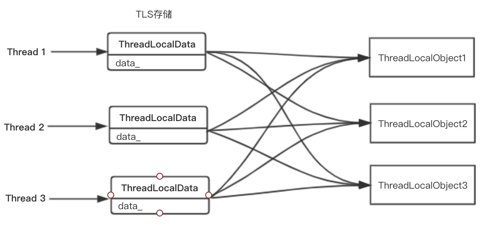
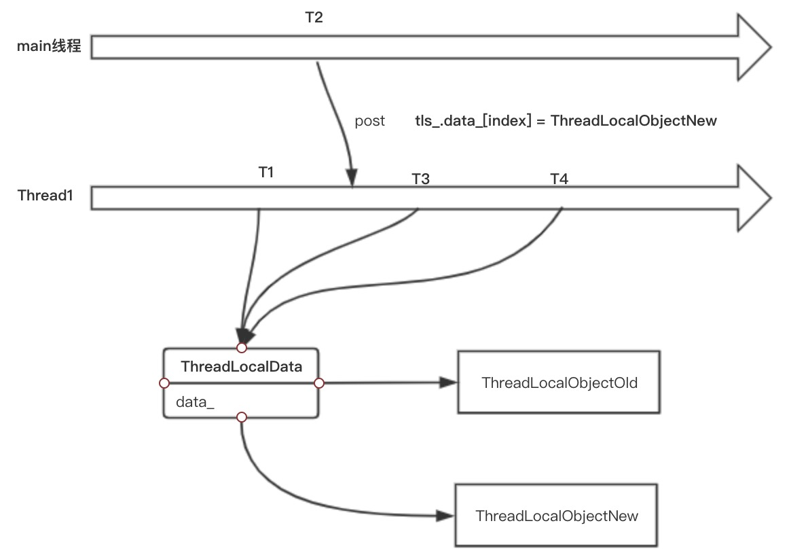

##### 4.3.1 ThreadLocalObject

​	Envoy要求所有的`ThreadLocal`数据对象都要继承`ThreadLocalObject`，比如下面这个`ThreadLocal`对象。

```cpp
struct ThreadLocalCachedDate : public ThreadLocal::ThreadLocalObject {
   ThreadLocalCachedDate(const std::string& date_string) : 
   date_string_(date_string) {}
  const std::string date_string_;
};
```

​	但实际上`ThreadLocalObject`只是一个空的接口类，所以并非我们继承了`ThreadLocalObject`就是一个TLS了。继承`ThreadLocalObject`目的是为了可以统一对所有要进行TLS的对象进行管理。

```cpp
class ThreadLocalObject {
public:
  virtual ~ThreadLocalObject() = default;
};
using ThreadLocalObjectSharedPtr = std::shared_ptr<ThreadLocalObject>;
```

​	Envoy中需要TLS的数据有很多，最重要的当属配置，随着配置的增多，这类数据所占据的内存也会变得很大，如果每一种配置都声明为TLS会导致不少内存浪费。为此Envoy通过`ThreadLocalData`将所有要进行TLS的对象都管理起来，然后将`ThreadLocalData`本身设置为TLS，通过TLS中保存的指针来访问对应的数据。这样就可以避免直接在TLS中保存数据而带来内存上的浪费，只需要保存指向数据的指针即可，相关代码如下。

```cpp
struct ThreadLocalData {
  // 指向当前线程的Dispatcher对象 
  Event::Dispatcher* dispatcher_{};
  // 保存了所有要TLS的数据对象的智能指针，通过智能指针来访问真正的数据对象
  std::vector<ThreadLocalObjectSharedPtr> data_;
};
```



 	如上图4-2所示，每一个TLS通过指针指向实际的对象，每一个数据对象只在内存中保存一份，避免内存上的浪费，但是这样带来问题就是如何做到线程安全的访问数据对象呢?  当我们要访问数据对象的时候，如果此时正在对数据对象进行更新，这个时候就会存在一个线程安全的问题了。Envoy巧妙的通过在数据对象更新的时候，先构造出一个新的数据对象，然后将TLS中的数据对象指针指向新的数据对象来实现线程安全的访问。本质上和COW(copy-on-write)很类似，但是存在两点区别。

* COW中是先拷贝原来的对象，然后更改对象，而Envoy在这里是重新构建一个新的数据对象
* COW中无论是读还是写，在更改`shared_ptr`指向时，都需要加锁，因为`shared_ptr`本身的读写时非线程安全的，而Envoy不需要加锁。


​	Envoy中指向数据对象的`shared_ptr`并非只有一个，而是每一个线程都有一个`shared_ptr`指向数据对象，更改`shared_ptr`指向新的数据对象时通过post一个任务到对应线程中，然后在同一个线程使`shared_ptr`指向新的数据对象，因此并没有多线程操作`shared_ptr`，所以没有线程安全问题，自然也不用加锁，这是Envoy实现比较巧妙的地方。




​	如上图4-3所示，T1时刻，Thread1通过TLS对象访问`ThreadLocalObjectOld`，在T2时刻在main线程发现配置发生了变化，重新构造了一个新的`ThreadlocalObjectNew`对象，然后通过Thread1的`Dispatcher`对象post了一个任务到Thread1线程，到了T3时刻这个任务开始执行，将对应的指针指向了 `ThreadLocalObjectNew`，最后在T4时刻再次配置的时候，就已经访问的是最新的配置了。到此为止就完成了一次配置更新，而且整个过程是线程安全的。